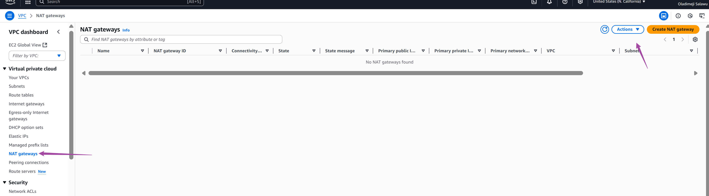
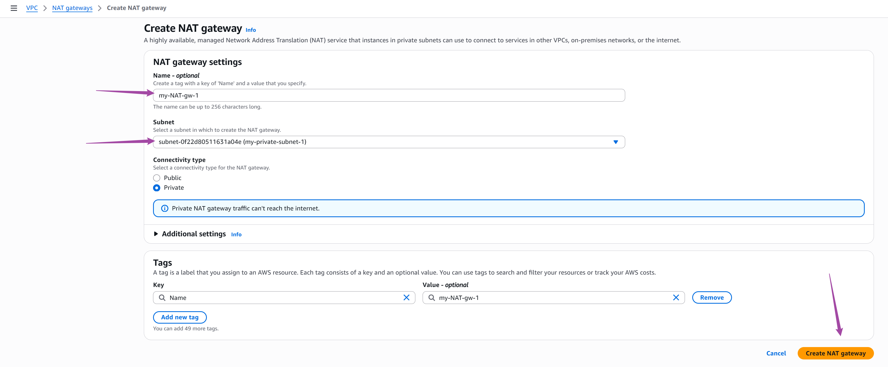
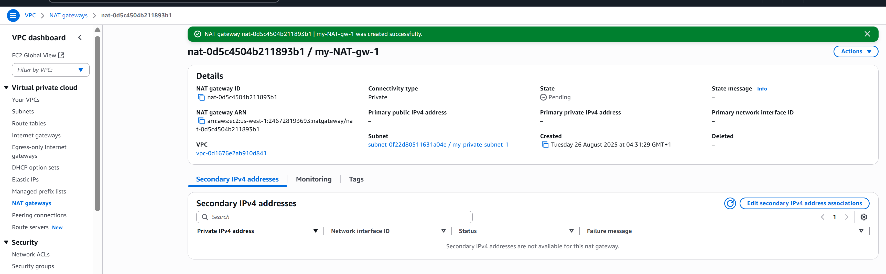
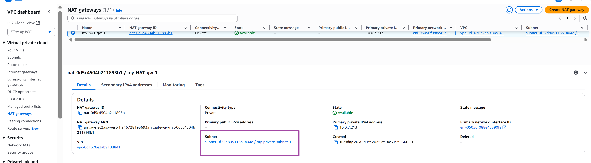
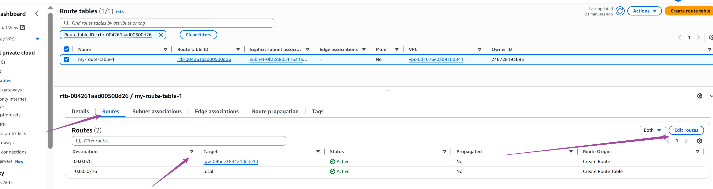
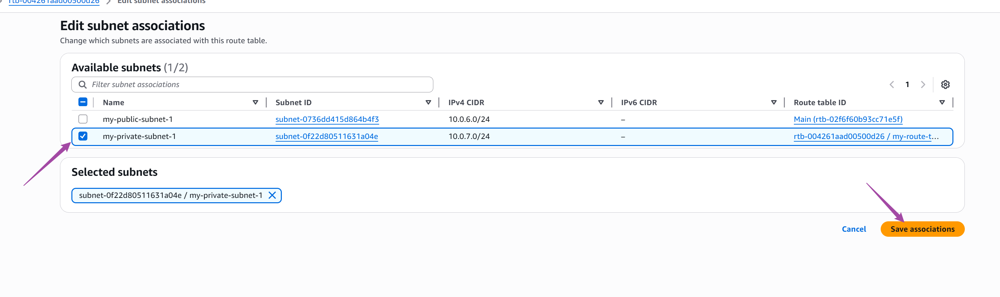
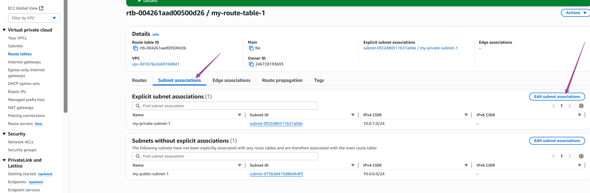

# aws-vpc-mini-project
hands-on project on vpc
##search for 'VPC' on the aws conle search bar

##create vpc

##

## Select subnets and choose create

##Configure the subnet like this

###Locate and select internet gateway

## Choose action

###Attach igw to vpc

##confirm attach

Repeat for the secong subnet

##Create aroute table

##

##Edit associate subnet

##Step -6 Creating two VPC in two region.

3. Now, provide a name for the VPC peering connection.

a) select the requester VPC.

b) Choose the account "My account" since the VPCs are in our own AWS account.

c) Ensure to use the same region, "This Region (ap-southeast-1)," as the VPCs were created in the same region.

d) Next, select the accepter VPC.

e) proceed by clicking on the "Create Peering Connection" button.

b) Click on Accept request.

5. Now, click on Main route table ID of the accepter VPC.

6. Choose the route table.
a) then navigate to the "Routes" section.
b) Click on "Edit route."

c) Click on add route.

7. Go to the VPC page

a) select the requester VPC.

b) In the details tab, you'll find the IPv4 CIDR. (in this case - 192.168.0.0/16)

c) Copy this CIDR and paste it in the "Destination" field when adding a route.

d) In the target, choose VPC peering and then choose the peering connection you have created. Click on save
changes

9. Now, click on Main route table ID of the requester VPC.

9. Now, click on Main route table ID of the requester VPC.

10. Choose the route table, then navigate to the "Routes" section. Click on "Edit route."

 Click on add route.

a) Paste the CIDR in the "Destination" field.

b) In the target, choose VPC peering

c) Then choose the peering connection you have created.

Alt text

The connection has been successfully established. Now, resources in the accepter VPC can connect to resources
in the requester VPC, and vice versa.

